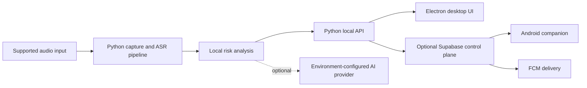

# SCUT

SCUT is a Windows and Android prototype for assisting with the detection of potentially fraudulent phone calls. It combines guarded audio input, speech recognition, local risk analysis, an Electron desktop application, an Android companion, and an optional Supabase control plane.

SCUT is an engineering prototype, not a guarantee of call capture, scam detection, or personal safety. It must be evaluated on the target Windows, Phone Link, Android, and audio-device combination before it is relied on.

## Overview

```text
phone-call audio or supported local input
  -> guarded capture / diagnostic input
  -> Whisper-based speech recognition
  -> local rules and optional semantic analysis
  -> risk assessment
  -> Windows desktop and Android companion UI
```

The Windows runtime explicitly records capture diagnostics instead of claiming that an unavailable Phone Link path works. Normal protection flow does not intentionally retain raw call audio.

## Key Features

- Windows desktop shell with local backend lifecycle management.
- Android companion for pairing, controller actions, and incident display.
- Guarded audio and Phone Link diagnostics that expose capture limitations.
- Whisper/ASR pipeline with configurable runtime profiles.
- Local risk classification plus an optional environment-configured AI provider.
- Supabase Edge Functions for authenticated device/control-plane synchronization.
- Firebase Cloud Messaging delivery through a server-side service-account secret.
- Tests covering backend, control-plane, Android product contracts, and desktop backend startup behavior.

## Architecture



## Tech Stack

- **Backend:** Python, local HTTP services, JSON state, audio/ASR tooling.
- **Desktop:** Electron, React, TypeScript, Vite, Vitest.
- **Android:** Java, Android SDK, Firebase Cloud Messaging.
- **Cloud control plane:** Supabase Edge Functions and SQL migrations.
- **Speech and ML:** Whisper-compatible ASR runtime and optional local model output.

## Repository Structure

```text
android/          Android companion application
backend/          Python API, capture, ASR, and risk-analysis services
desktop/          Electron and React desktop application
frontend/         Bundled local frontend assets
supabase/         Edge Functions and database migrations
tests/            Python product, backend, and control-plane tests
scripts/          Build, portability, validation, and packaging helpers
windows-audio/    Native Windows audio helper source and tooling
```

## Getting Started

Prerequisites depend on the component you want to work on:

- Python runtime compatible with `requirements.txt`.
- Node.js and npm for the Electron desktop application.
- Android SDK/Gradle tooling for the Android companion.
- A configured Supabase project only when testing cloud-control features.

1. Clone the repository.
2. Copy `.env.example` to a local ignored `.env` or configure the equivalent environment variables in your shell/runtime.
3. For Supabase Edge Functions, use `supabase/.env.example` as a template and set deployed values with `supabase secrets set`.
4. Obtain local ASR/model assets separately; they are intentionally not stored in Git.
5. Use the existing project scripts appropriate to the component:

```powershell
# Python tests
python -m unittest discover -s tests -v

# Desktop checks
Set-Location desktop
npm run typecheck
npm test
```

The portable Windows flow is documented by `FIRST_RUN.bat`, `CONFIGURE.bat`, `START_SCUT.bat`, `BUILD_ANDROID.bat`, and `PREPARE_TRANSFER.bat`. These scripts can perform environment-specific actions, so inspect them before use on a new machine.

## Environment Configuration

`.env.example` lists the environment variables consumed by the local Python and desktop runtime. It contains placeholders only.

The Supabase Edge Functions require server-side `SUPABASE_URL`, `SUPABASE_SERVICE_ROLE_KEY`, and `FCM_SERVICE_ACCOUNT_JSON`. These are deployment secrets; do not put them in client code, Android resources, Git, or screenshots.

## Models and Runtime Assets

Model weights, downloaded Whisper assets, packaged Python runtimes, generated ONNX/PyTorch output, installers, and release builds are excluded from this repository. Place them in the local runtime/cache locations expected by the setup scripts, or provision them through a documented internal artifact process.

## Testing

```powershell
python -m unittest discover -s tests -v

Set-Location desktop
npm run typecheck
npm test
```

Android validation requires a locally configured Android SDK and is not assumed by the repository alone.
Some deeper audio and model-validation suites additionally require local fixture data and model assets that are intentionally excluded from Git.

## Technical Highlights

- Multi-platform coordination across Python, Electron, Android, and Supabase.
- Explicit failure handling for audio-capture availability.
- Local-first risk evaluation with optional network analysis.
- Runtime state separated from source code.
- Authenticated device/control-plane flows and server-side FCM integration.
- Existing backend and desktop test coverage.

## Privacy and Security

Credentials, Firebase service accounts, Supabase service-role keys, local pairing material, session state, recordings, logs, diagnostics, generated reports, model files, and build artifacts are excluded from Git. Keep deployment secrets in the appropriate local environment or managed secret store.

## Limitations

- Phone Link audio capture is platform- and device-dependent.
- Risk assessment is probabilistic and must not be treated as a security guarantee.
- Cloud control-plane and FCM features require separately provisioned infrastructure.
- Model/runtime assets are not included in the repository.
- This project is not a substitute for emergency services, fraud reporting, or professional security advice.
