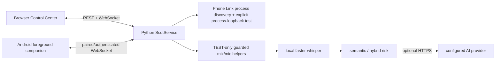

# SCUT UI redesign handoff

## Executive summary

SCUT is a Windows-and-Android hackathon MVP intended to warn a paired Android device when caller transcript text indicates a scam. The runnable UI is a browser-based local Control Center, backed by a Python service; it is not yet a Windows desktop application shell. The core has real local semantic classification, Android alert delivery, explicit Phone Link process-loopback diagnostics, and TEST-only guarded system-mix transcription. It does **not** have a verified always-on real Phone Link call-capture pipeline in `PROTECT`.

## Product purpose and verified features

- **VERIFIED:** modeful protection (`OFF`, `TEST`, `PROTECT`), stable-text risk evaluation, paired Android alerts, explicit Android alert test, pairing/auth/heartbeat/ack, and live status/events.
- **VERIFIED:** Phone Link/CrossDevice process discovery and a six-second native process-loopback WAV diagnostic; PASS requires observed process PCM.
- **VERIFIED:** TEST-only guarded system-mix/microphone PCM capture and final local faster-whisper transcription, gated by a device-specific audio sentinel.
- **VERIFIED:** local semantic/rule/hybrid risk logic, optional structured HTTPS semantic extraction, optional lazy Nomic deployment.
- **NOT IMPLEMENTED:** continuous process-attributed Phone Link capture, automatic call lifecycle, call/alert/transcript history, manual “I feel unsafe” alert, dismissal/cancel/cooldown, and a desktop wrapper.

Evidence: `backend/services.py:145-273`, `309-371`, `410-457`; `backend/server.py:50-194`; `windows-audio/scut_process_loopback.cpp:57-111`.

## High-level architecture

The launcher starts a project-local Python server then opens the browser (`scripts/start-scut.ps1:1-10`). The server serves static `frontend/` files and exposes REST/WebSocket (`backend/server.py:33-38`, `50-232`). Android is a Java foreground service, not a mobile call recorder (`android/app/src/main/java/org/scut/app/ScutService.java:14-27`).

## Complete real lifecycle (important distinction)

There is no one complete automatic phone-call lifecycle. Two separate flows exist:

1. **Phone Link verification:** user presses Test Call Capture → server discovers Phone Link/CrossDevice processes → native helper records one six-second per-process loopback test → PASS requires signal/no error/nonempty WAV → diagnostic telemetry and optional playback. It neither starts ongoing ASR nor creates a call record.
2. **Guarded transcript diagnostic:** in TEST, user starts guarded transcription → helper captures default communications system mix only when its sentinel is active → service frames PCM, VAD-delimits utterances, decodes final caller audio with Whisper → transcript is classified → WebSocket/status update. Caller can trigger an alert only after switching to PROTECT, but `PROTECT` itself does not start this capture worker.

Final transcript events include speaker and audio timestamps; status retains only latest text. Raw capture PCM remains memory-only; the separate explicit Phone Link diagnostic writes a WAV (`backend/services.py:179-240`, `410-457`).

## Audio, STT and live constraints

Process loopback targets discovered Phone Link/CrossDevice PIDs using Windows Core Audio process-loopback. The guarded helper instead loopbacks the default communications endpoint and identifies a call through a hard-coded display-name sentinel, so it reports `NOT_PROCESS_ATTRIBUTED` (`backend/guarded_audio.py:30-42`, `windows-audio/scut_guarded_mix_pcm_stream.cpp:1-8`).

Whisper uses local `faster-whisper`; default caller profile is CUDA `large-v3-turbo`, with explicit CPU small recovery. Active final transcription detects language and produces internal segment quality data, but the browser contract exposes only latest final text. No durable full transcript, speaker timeline, confidence timeline, or language schema exists (`backend/guarded_audio.py:43-65`, `backend/config.py:31-40`).

## Risk, alerts and user actions

Final texts feed local semantic facts and HybridBrain. A `PROTECT` critical hybrid result sends a generic safe warning to all connected sessions; Android vibrates, raises a high-priority notification and, with permission, shows a 12-second overlay. Rich decision data contains reason codes, risk score, actions, evidence spans, protective context and language information. It is emitted but the current browser ignores it (`backend/services.py:309-371`, `backend/hybrid_v1.py:160-189`).

Mode change resets semantic/hybrid state. There is no alert persistence, dismissal/cancel endpoint, manual alert, debounce/cooldown, or reliable single-alert guard. Android ACK updates a latency metric only.

Current usable actions: choose mode; inject a diagnostic stable transcript; pair Android; test Android alert/network/earbuds/pre-demo; test Phone Link capture; start guarded test transcript; replay verified test recording. See `06_UI_STATES_AND_ACTIONS.md` for conditions and effects.

## Frontend/backend interface and data

The redesign can use REST status/mode/pair/transcript/diagnostic/test-alert endpoints and WebSocket `status`, `risk_event`, `decision`, `FINAL_TRANSCRIPT`, and `alert` messages. Current status has latest mode, probes, audio state, Android, latest risk/transcript, metrics and 20 events, with variable `audio` shape. It must not assume history or stable detailed schemas. Full concise contract: `05_FRONTEND_BACKEND_CONTRACT.md`.

Persistent UI-relevant data is limited to paired-device metadata/credential under `.local/devices.json` and machine configuration under `.local/machine.json`; these survive restart. Transcripts, events, metrics, risk, capture state and pairing tokens are process memory. Do not design a real history experience without new backend work (`backend/config.py:8-29`, `backend/services.py:83-100`, `275-307`).

## Current UI / desktop / mobile

Existing frontend is a one-screen vanilla browser Control Center: mode control, status cards, latest transcript/risk, metrics, diagnostics, capture telemetry, pairing and events. It polls every 5 seconds and reconnects WebSocket. It does not render detailed risk events or final transcript metadata (`frontend/app.js:8-14`, `frontend/index.html:10-36`).

There is no Electron/Tauri/WebView/native Windows wrapper, tray, hotkey, startup integration, transparent/always-on-top/floating window or native desktop notifications. A future Granola/Wispr-like Windows application therefore needs a new shell. Android is only the companion alert receiver, with no history or call capture.

## States and errors a UI must represent

Represent OFF/TEST/PROTECT; Phone Link not detected/candidates/testing/PASS/FAIL; guarded transcription starting/capturing/final/error; latest SAFE/SUSPICIOUS/CRITICAL decision; Android offline/connected/permission state; backend unavailable/reconnecting; Whisper not ready; provider not configured/degraded; and diagnostic-specific reasons. States are mostly mutable string values, not a formal enum. See `06_UI_STATES_AND_ACTIONS.md`.

Important real failures: missing helper, no Phone Link candidate, silent process audio, sentinel inactive, guarded/mic helper failure, model not prepared, configured provider failure/invalid response, no authenticated Android, and local server unavailable. Capture/test failures have useful reasons; a general call lifecycle does not exist.

## Verified demo flow

Strongest defensible demo: start local Control Center → pair Android → test Android alert → independently run Phone Link capture diagnostic during a real suitable call → demonstrate `PROTECT` critical detection with injected stable caller text → Android warning. TEST guarded transcription can be shown separately if sentinel/audio conditions work. Do not claim fully automatic live Phone Link protection. Details and preparation risks: `09_DEMO_FLOW.md`.

## Design decisions required before implementation

1. Is the redesign a new native Windows shell, or still a local web UI? This repo has no wrapper.
2. Should UI distinguish **capture verified** from **continuous protection active**? It must; current backend does.
3. What product behavior should exist for manual panic/report, alert acknowledgement/dismissal, history, retention, privacy consent and settings? Backend lacks them.
4. Which rich risk fields become stable public contracts, and should finalized transcript timeline/language/evidence be persisted?
5. Should Android remain the only alert surface or should Windows also notify/float?

## Limits / confidence

The repository cannot prove target-machine audio support or Nomic/AI configuration availability. A targeted test attempt in this audit environment failed before tests ran because its Python 3.14 lacks `audioop`; shipped bootstrap targets Python 3.12. The audit excluded generated/dependency/binary/model/media/report/log directories and did not reproduce secrets or private runtime data. Full limits: `10_GAPS_AND_UNKNOWNS.md`.

## Source evidence index

- Service/modes/capture/transcript/alerts: `backend/services.py:117-457`
- HTTP and WebSocket: `backend/server.py:50-266`
- Audio/STT: `backend/guarded_audio.py:1-65`, `backend/realtime_pipeline.py:45-104`
- Windows process loopback: `windows-audio/scut_process_loopback.cpp:57-111`
- Risk: `backend/semantic_risk.py:90-273`, `backend/hybrid_v1.py:160-189`
- Browser: `frontend/index.html:10-36`, `frontend/app.js:6-14`
- Android: `android/app/src/main/java/org/scut/app/MainActivity.java:17-24`, `android/app/src/main/java/org/scut/app/ScutService.java:14-27`
