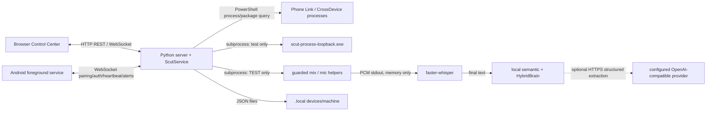

# Runtime architecture

## Startup and processes

`START_SCUT.bat` runs `scripts/start-scut.ps1`, which requires the project-local Python 3.12 virtual environment, APK and passing Whisper self-test, starts `backend/server.py`, writes its PID/port record, then opens the browser (`START_SCUT.bat:3-4`, `scripts/start-scut.ps1:1-10`). `server.py` selects an available port in a 20-port range and serves on `0.0.0.0` while displaying the local URL (`backend/server.py:235-266`).

## Communication edges

| Source → destination | Mechanism / payload | Evidence |
|---|---|---|
| Browser → server | REST `POST` and unauthenticated local WebSocket subscribe | `backend/server.py:50-109`, `frontend/app.js:6-14` |
| Android → server | WebSocket: `pair`, `auth`, `heartbeat`, `ack`; server sends `hello`, `paired`, `authenticated`, `alert`, status | `backend/server.py:152-194`, `android/app/src/main/java/org/scut/app/ScutService.java:17-27` |
| Server → Phone Link candidates | PowerShell asks AppX packages and Win32 processes; matching process metadata returned | `backend/services.py:26-55` |
| Server → process-loopback helper | six-second subprocess run; helper returns final JSON and writes diagnostic WAV | `backend/services.py:57-75`, `backend/services.py:410-457` |
| Guarded helpers → server | raw 48 kHz stereo PCM on stdout; no normal PCM disk write | `backend/guarded_audio.py:30-42`, `windows-audio/scut_guarded_mix_pcm_stream.cpp:1-8` |
| Server → optional AI | HTTPS OpenAI-compatible chat completion; structured semantic facts only | `backend/semantic_risk.py:90-153` |

## Critical architecture distinction

**VERIFIED:** process loopback validates a selected Phone Link/CrossDevice process during an explicit diagnostic. **VERIFIED:** guarded transcription runs only while mode is `TEST` and captures the default communications endpoint when a hard-coded audio-session sentinel is active. **NOT IMPLEMENTED:** a continuous process-attributed Phone Link capture/transcription lifecycle in `PROTECT`; no worker is started by `set_mode("PROTECT")` (`backend/services.py:145-192`, `backend/services.py:410-457`).
