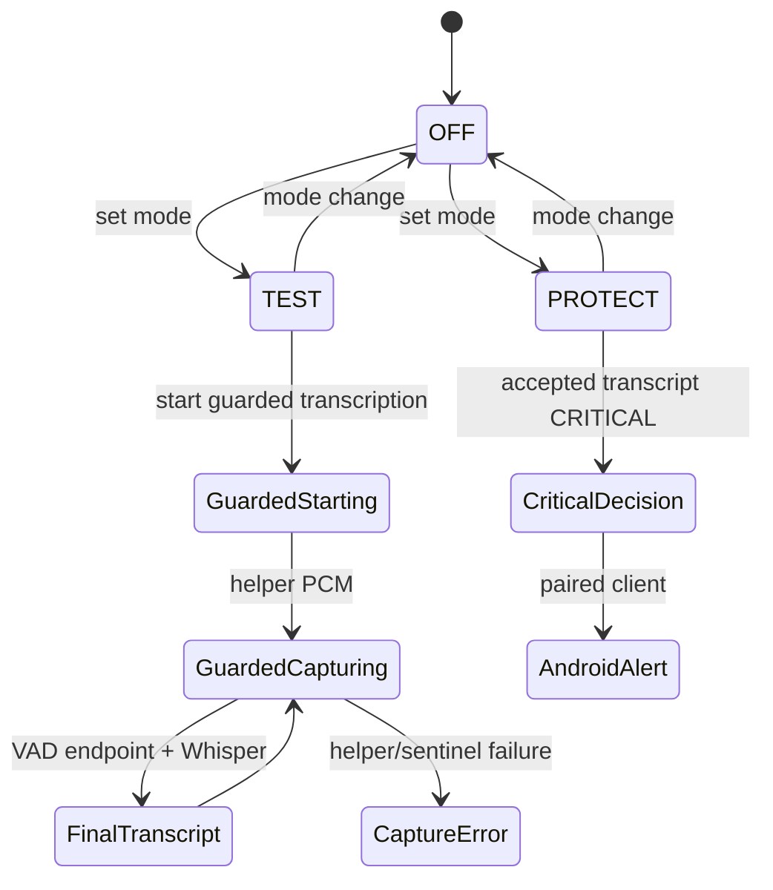

# Product states and actions

## Derived state machine

These are **DERIVED** UI states from string fields/control flow, not an application enum.

| Group/state | Meaning/data | Actions/transitions |
|---|---|---|
| Application: OFF / TEST / PROTECT | selected mode and latest risk | set mode; all reset risk state |
| Phone Link: NOT DETECTED / candidates found | package probe or diagnostic candidate list | test capture |
| Capture diagnostic: NOT TESTED / PASS / FAIL | candidate PID/name/RMS/peak/reason | play verified recording on PASS; retest |
| Guarded audio: STARTING / CAPTURING / FINAL_TRANSCRIPT / error | strategy/source always `SYSTEM_MIX_GUARDED`, attribution `NOT_PROCESS_ATTRIBUTED` | only TEST may start; set mode exits |
| Transcription: waiting / fast partial / final | latest text, sometimes speaker/language/timing | no user control besides test start/mode |
| Risk: SAFE / SUSPICIOUS / CRITICAL | latest decision plus WS rich details | injected transcript diagnostic; protection alert only at CRITICAL |
| Android: OFFLINE / CONNECTED | paired device name + reported permissions | pair, manage permissions on Android |

## Existing user actions

| Action | Command/precondition | Side effect / failure |
|---|---|---|
| Set protection mode | `POST /api/mode`; one of 3 modes | resets engines; leaving TEST stops guarded worker |
| Inject transcript | `POST /api/transcripts`; <=4000 chars | diagnostic semantic analysis; in PROTECT can alert |
| Pair Android | `POST /api/pair` then Android pair WS | 5-min one-time token; device credential persisted |
| Test Android alert | `POST /api/alerts/test` | alert to connected WS sessions only |
| Test network / earbuds / predemo | corresponding diagnostics | status-only checks; earbuds returns instruction, not a playback test |
| Test Phone Link capture | explicit source plus helper/candidate availability | diagnostic WAV only on PASS |
| Test guarded transcript | requires TEST | starts guarded mix/mic/ASR threads; sentinel/helper error possible |
| Play recording | GET recording; selected capture needed | browser audio playback |

No current UI action exists for alert acknowledgement, dismissal, cancellation, history navigation, settings, reconnect helper, or continuous capture.
